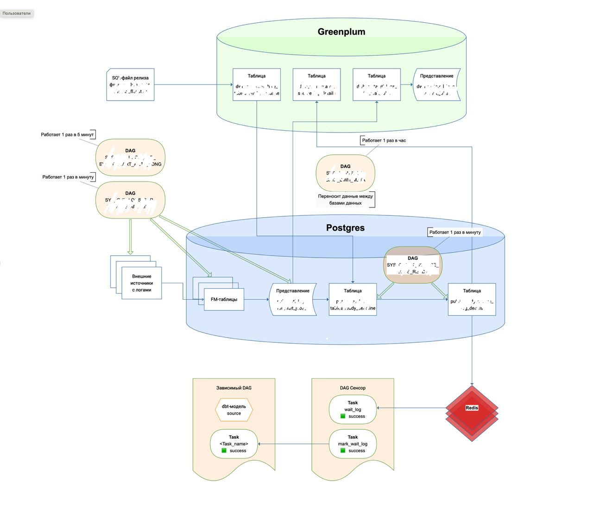

# Запуск потоков по событию

Работа части потоков данных в ночном и вечернем регламентах связана с источниками, которые не имеют четкого времени готовности. Эти потоки не запускаются Airflow, пока в Postgres не появятся логи готовности источников. Такой запуск называется событийным.

Структура событийного запуска:

1. [dbt-модели](#_2) — в них указываются зависимости от логов источников.
2. [Представление](#_3) — хранит логи готовности источников.
3. [Настройки обработки логов](#_4) — хранятся в таблице и задаются через SQL-функцию.
4. [Таблица обработанных логов](#_5) — хранит логи из представления, настройки и результат их обработки.
5. Redis — хранит данные сводной таблицы и обеспечивает к ним быстрый доступ.
6. [Сенсоры](#_6) — проверяют в Redis готовность логов и сообщают Airflow, что зависимые потоки могут быть запущены.

Большинство этапов событийного запуска выполняется автоматически. Чтобы привязать поток к событийному запуску разработчику необходимо:

1. [Установить зависимости](#_2) потока от события в dbt-модели. 
2. [Задать настройки](#_4) для обработки логов.



## Установить зависимости потока от события 

Чтобы поток данных внутри регламента запускался по событию, нужно указать на уровне dbt-модели от каких источников он зависит. Для этого укажите в объекте source модели название external-таблицы, которая ссылается на лог из представления view.name.

Во время запуска регламента Airflow определит, что поток зависит от лога и запустит его только, когда на сенсоре появится метка готовности лога.

##  Где хранятся логи готовности источников

Наименование | Значение |
------------ | ------------- | 
**Представление** | view_name |
**База данных** | Postgres |
**Какие даги загружают данные**	| DAG_NAME1 DAG_NAME2 |
**Какой даг выгружает данные** | DAG_NAME |

Логи готовности источников хранятся в представлении view.name. На следующих этапах событийного механизма, данные представления будут обработаны и добавлены в Redis.

Логи собираются из fm-таблиц и добавляются с помощью системных дагов: DAG_NAME1 и DAG_NAME2, которые:

1. Собирают данные из внешних источников в fm-таблицы в Postgres.
2. Загружают данные из fm-таблиц в представление.

Даг DAG_NAME собирает логи каждую минуту.

Даг DAG_NAME собирает логи раз в 5 минут.


Для обратной совместимости настроена синхронизация между базами данных Postgres и Greenplum с помощью дага DAG_NAME. Даг переносит данные из представления view_name в таблицу в Greenplum table_name. Затем в Greenplum формируется представление view_name доступное для пользователей.

## Задать настройки обработки логов источников 
Наименование | Значение |
------------ | ------------- | 
**Исходная таблица** | table_name |
**Исходная база данных** | Greenplum |
**Целевая таблица** | table_name |
**База данных** | Postgres |
**Какой даг загружает данные**	| DAG_NAME |
**Какой даг выгружает данные** | DAG_NAME |

Для каждого лога источника можно задать набор настроек, которые будут применяться при релизе. Настройки прописываются в функции func_name в SQL-файле релиза:

```
SELECT func_name (
    '000000000', --база таблицы-источника в Hive
    'name', --имя таблицы-источника в Hive
    0, --время дедлайна (час)
    0, --время дедлайна (минута)
    null, --время начала чтения логов (час)
    null, --время начала чтения логов (минута)
    1, --количество записей логов
);
```

Функция выполняется вместе с остальным SQL-кодом во время релиза:

1. Настройки добавляются в таблицу table_name в Greenplum. Если в таблице были предыдущие данные о настройках обработки лога источника, они считаются неактуальными и не применятся.
2. Даг DAG_NAME загружает данные настроек в целевую таблицу table_name в Postgres.


## Таблица обработанных логов 

Наименование | Значение |
------------ | ------------- | 
**Таблица** | table_name |
**База данных** | Postgres |
**Какой даг загружает и выгружает данные**	| DAG_NAME |

В таблице table_name собираются данные:

- логи источников из представления;
- настройки обработки логов;
- обработанные логи после применения настроек.

Данные попадают в таблицу с помощью дага DAG_NAME.

Что делает даг:

1. Выгружает данные из представления view_name.
2. Выгружает данные из таблицы table_name1.
3. Загружает данные в таблицу table_name2.
4. Отправляет данные в Redis.

Даг DAG_NAME переносит данные из таблицы в Postgres table_name1 в таблицу в Greenplum table_name2, которая доступна для пользователей.

## Проверка готовности лога сенсорами 

В вечернем и ночном регламентах есть отдельные даги — сенсоры. Когда Airflow запускает регламент, он запускает сенсоры, которые проверяют готовности логов для зависимых потоков данных. Для этого внутри сенсоров есть две задачи: task1 и task2.

При выполнении задачи task1 сенсор:

1. Читает объект с логами object_name в Redis.
2. Ищет лог по ключу в объекте.
3. Меняет статус задачи на «success» если лог найден.

Если лог не найден, задача перезапускается до тех пор, пока лог не найдется. 

Когда лог получен, запускается задача task2:

1. Сенсор находит одноименную задачу в основном даге.
2. Меняет статус задачи на «success».
3. Airflow запускает зависимый поток данных на выполнение.

Если лог не был получен, зависимый от него поток все равно запустится по расписанию.